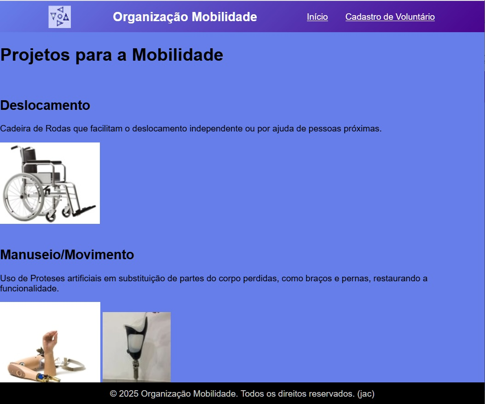
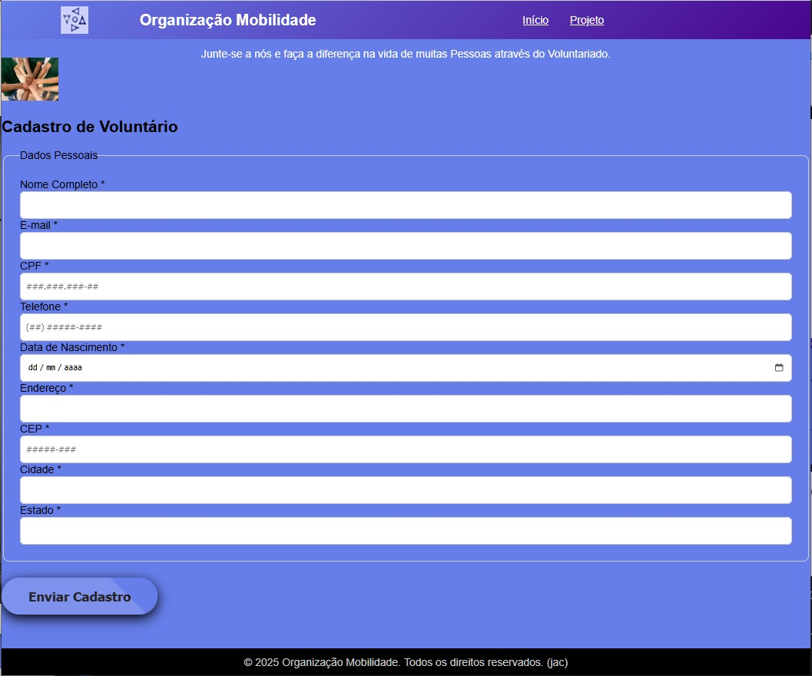

# FrontEnd Web Prática IV

Organização Mobilidade - Social

## Índice
- <a href="#funcionalidades">Funcionalidades do Projeto</a>
- <a href="#layout">Layout</a>
- <a href="#demonstração">Demonstração</a>
- <a href="#rodar">Como executar este Projeto></a>
- <a href="#tecnologias">Tecnologias Utilizadas</a>
- <a href="#autores">Autor do Projeto</a>
- <a href="#passos">Próximos Passos</a>

## Funcionalidades

- [x] Projetos
- [x] Cadastro de Voluntários

## Layout

## Demonstração
[Link](https://jonascoco.github.io/frontend-web-praticaIV)

## Tecnologias
[HTML]() - [CSS]()

## Autor do Projeto
[Jonas Aparecido Côco]()
 [Cruzeiro do Sul - UNICID Universidade Cidade de S. Paulo]()

[Linkedin](https://www.linkedin.com)

## Próximos Passos
- [] Enviar E-Mail contendo novidades da Organização
- [] Informar os Benefícios alcançados pelo Volutariado

